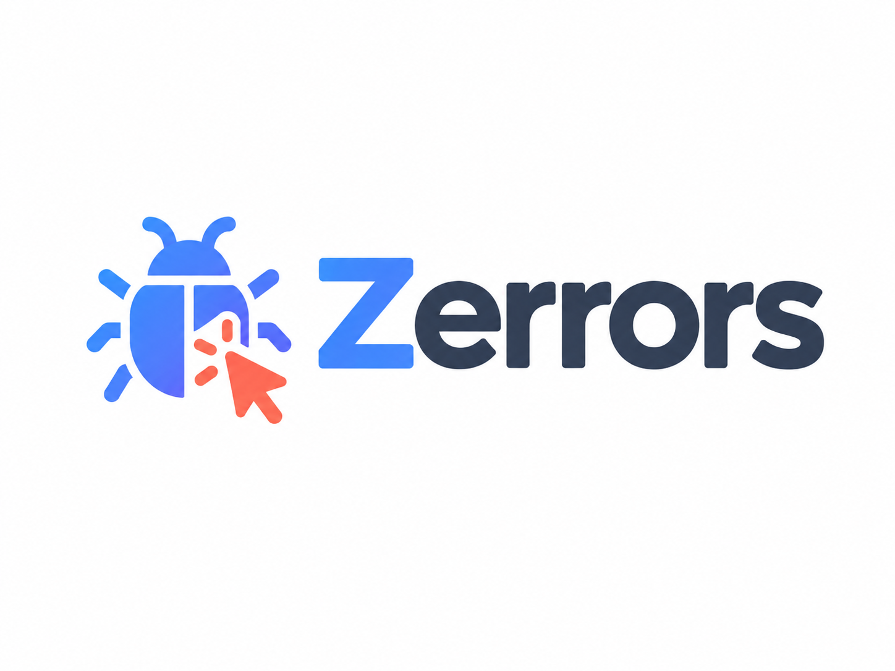

<p align="center">
  
</p>

<p align="center">
  Self-hosted error tracking for your applications — Sentry-compatible ingestion, AI-assisted issue analysis, and multi-organization workspaces, built on Laravel.
</p>

## What is Zerrors?

Zerrors collects exceptions and error events from your applications (via the Sentry SDK/DSN protocol) and gives your team a place to triage, discuss, and resolve them.

- **Organizations & projects** — group projects under organizations, invite teammates, and manage roles/members.
- **Sentry-compatible ingestion** — point any existing Sentry SDK at a Zerrors project DSN (`/api/{projectId}/envelope` and `/api/{projectId}/store`) with no code changes.
- **Issue tracking** — events are grouped into issues, with occurrence counts, releases, environments, and regression detection.
- **AI-assisted analysis** — ask for an AI summary or a deeper investigation of an issue directly from the UI.
- **Notifications** — per-project alert channels (email, Slack, Telegram) with configurable rules: new issue, regression, every event, or occurrence thresholds.
- **GitHub integration** — create GitHub issues from a Zerrors issue, and forward events to Sentry as a second DSN if you want to keep both.
- **Security** — two-factor authentication, audit logging, and a REST API for programmatic access.

## Tech stack

- [Laravel](https://laravel.com) 13 (PHP 8.4)
- [Livewire](https://livewire.laravel.com) for interactive UI
- [Laravel Horizon](https://laravel.com/docs/horizon) for queue processing of incoming events
- [Laravel AI](https://laravel.com/docs/ai) for issue analysis
- [Sentry SDK](https://docs.sentry.io/platforms/php/guides/laravel/) compatibility for ingestion
- Tailwind CSS + Alpine.js on the frontend

## Getting started

### Requirements

- PHP 8.4+
- Composer
- Node.js & npm
- A database supported by Laravel (MySQL/PostgreSQL/SQLite)
- Redis (recommended, used by Horizon/queues)

### Installation

```bash
composer install
npm install

cp .env.example .env
php artisan key:generate

php artisan migrate

npm run build
```

### Running locally

```bash
composer run dev
```

This starts the app server, queue worker, and Vite dev server together. Visit the app and register the first account to create your organization.

### Sending errors to Zerrors

Once you've created a project, use its DSN with any [Sentry SDK](https://docs.sentry.io/platforms/) exactly as you would with Sentry — Zerrors implements the same ingestion endpoints.

## Testing

```bash
php artisan test
```

## Code style

This project uses [Laravel Pint](https://laravel.com/docs/pint):

```bash
vendor/bin/pint
```

## License

This project is open-sourced software licensed under the [MIT license](https://opensource.org/licenses/MIT).
